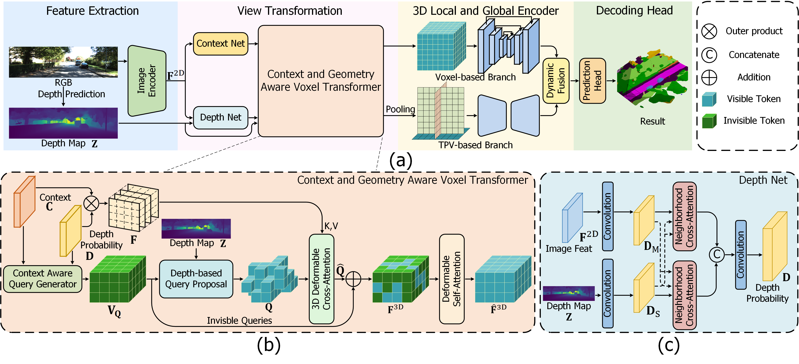

# Context and Geometry Aware Voxel Transformer for Semantic Scene Completion

## 🚀 News

- **2024.5.27** code released
- **2024.5.24** [**arXiv**](https://arxiv.org/pdf/2405.13675v4) preprint released

## Introduction

Vision-based Semantic Scene Completion (SSC) has gained much attention due to its widespread applications in various 3D perception tasks. Existing sparse-to-dense methods typically employ shared context-independent queries across various input images, which fails to capture distinctions among them as the focal regions of different inputs vary and may result in undirected feature aggregation of cross attention. Additionally, the absence of depth information may lead to points projected onto the image plane sharing the same 2D position or similar sampling points in the feature map, resulting in depth ambiguity. In this paper, we present a novel context and geometry aware voxel transformer. It utilizes a context aware query generator to initialize context-dependent queries tailored to individual input images, effectively capturing their unique characteristics and aggregating information within the region of interest. Furthermore, it extend deformable cross-attention from 2D to 3D pixel space, enabling the differentiation of points with similar image coordinates based on their depth coordinates. Building upon this module, we introduce a neural network named CGFormer to achieve semantic scene completion. Simultaneously, CGFormer leverages multiple 3D representations (i.e., voxel and TPV) to boost the semantic and geometric representation abilities of the transformed 3D volume from both local and global perspectives. Experimental results demonstrate that CGFormer achieves state-of-the-art performance on the SemanticKITTI and SSCBench-KITTI-360 benchmarks, attaining a mIoU of 16.87 and 20.05, as well as an IoU of 45.99 and 48.07, respectively.

## Method



Schematics and detailed architectures of CGFormer. (a) The framework of the proposed CGFormer for camera-based semantic scene completion. The pipeline consists of the image encoder for extracting 2D features, the context and geometry aware voxel (CGVT) transformer for lifting the 2D features to 3D volumes, the 3D local and global encoder (LGE) for enhancing the 3D volumes and a decoding head to predict the semantic occupancy. (b) Detailed structure of the context and geometry aware voxel transformer. (c) Details of the Depth Net.

## Quantitative Results


## Getting Started

step 1. Refer to [install.md](./docs/install.md) to install the environment.

step 2. Refer to [dataset.md](./docs/dataset.md) to prepare SemanticKITTI and KITTI360 dataset.

step 3. Refer to [train_and_eval.md](./docs/train_and_eval.md) for training and evaluation.

step 4. Refer to [visualize.md](./visualize.md) for training and evaluation.

## Model Zoo

We provide the pretrained weights on SemanticKITTI and KITTI360 datasets, reproduced with the released codebase.


|                      Dataset                       |    Backbone    |        IoU         |        mIoU        |                        Model Weights                         |                        Training Logs                         |
| :------------------------------------------------: | :------------: | :----------------: | :----------------: | :----------------------------------------------------------: | :----------------------------------------------------------: |
| [SemanticKITTI](configs/semantickitti_CGFormer.py) | EfficientNetB7 | 44.41, 45.99 (val) | 16.63, 16.89 (val) | [Link](https://github.com/pkqbajng/CGFormer/releases/download/v1.0/CGFormer_semantickitti.ckpt) | [Link](https://github.com/pkqbajng/CGFormer/releases/download/v1.0/CGFormer_semantickitti_logs.zip) |
|   [KITTI360](configs/semantickitti_CGFormer.py)    | EfficientNetB7 |       48.07        |       20.05        | [Link](https://github.com/pkqbajng/CGFormer/releases/download/v1.0/CGFormer_kitti360.ckpt) | [Link](https://github.com/pkqbajng/CGFormer/releases/download/v1.0/CGFormer_kitti360_logs.zip) |

## Acknowledgement

Many thanks to these exceptional open source projects:
- [BEVFormer](https://github.com/fundamentalvision/BEVFormer)
- [mmdet3d](https://github.com/open-mmlab/mmdetection3d)
- [MonoScene](https://github.com/astra-vision/MonoScene)
- [semantic-kitti-api](https://github.com/PRBonn/semantic-kitti-api) 
- [MobileStereoNet](https://github.com/cogsys-tuebingen/mobilestereonet)
- [Symphonize](https://github.com/hustvl/Symphonies.git)
- [DFA3D](https://github.com/IDEA-Research/3D-deformable-attention.git)
- [VoxFormer](https://github.com/NVlabs/VoxFormer.git)
- [OccFormer](https://github.com/zhangyp15/OccFormer.git)

As it is not possible to list all the projects of the reference papers. If you find we leave out your repo, please contact us and we'll update the lists.

## Bibtex

If you find our work beneficial for your research, please consider citing our paper and give us a star:

```
@inproceedings{CGFormer,
  title={Context and Geometry Aware Voxel Transformer for Semantic Scene Completion},
  author={Yu, Zhu and Zhang, Runmin and Ying, Jiacheng and Yu, Junchen and Hu, Xiaohai and Luo, Lun and Cao, Si-Yuan and Shen, Hui-Liang},
  booktitle = {Advances in Neural Information Processing Systems},
  year={2024}
}
```

If you encounter any issues, please contact zhu.yu.pk@gmail.com.

## To do

- Visualization scripts
